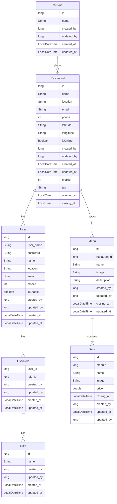

```mermaid
erDiagram
 Cuisine ||--o{ Restaurant : places 
    Cuisine {
        long id
        String name
        long created_by
        long updated_by
        LocalDateTime created_at 
        LocalDateTime updated_at
    }
    
    Restaurant ||--o{ Menu : places 
    Restaurant ||--o{ User : has 
    Restaurant {
        long id
        String name
        String location
        String email
        int phone
        String latitude
        String longitude
        boolean isOnline
        long created_by
        long updated_by
        LocalDateTime created_at 
        LocalDateTime updated_at
        int mobile
        String tag
        LocalTime opening_at
        LocalTime closing_at
    }

    User ||--o{ UserRole : has 
    User {
        long id
        String user_name
        String password
        String name
        String location
        String email
        int mobile
        boolean isEnable
        long created_by
        long updated_by
        LocalDateTime created_at 
        LocalDateTime updated_at
    }
     UserRole ||--o{ Role : has 
     UserRole {
        long user_id
        long role_id
        long created_by
        long updated_by
        LocalDateTime created_at 
        LocalDateTime updated_at
    }

    Role {
        long id
        String name
        long created_by
        long updated_by
        LocalDateTime created_at 
        LocalDateTime updated_at
    }

    Menu ||--|{ Item : contains
    Menu {
     long id
     long restaurantId
     String name
     String image
     String description
     long created_by
     long updated_by
     LocalDateTime closing_at 
     LocalDateTime updated_at
    }
    Item {
     long id
     long menuId
     String name
     String image
     double price
     LocalDateTime closing_at
     long created_by
     LocalDateTime updated_at
     long updated_by
    }
```
